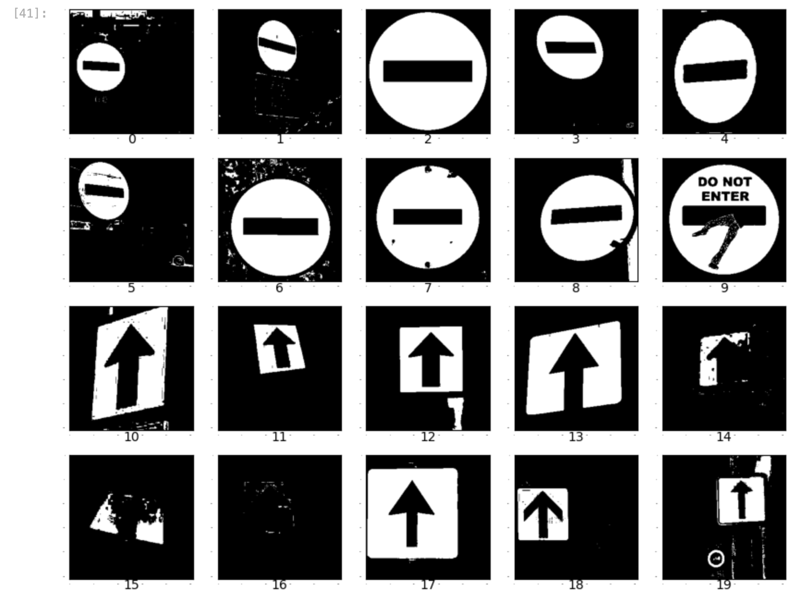

---
jupytext:
  notebook_metadata_filter: rise
  text_representation:
    extension: .md
    format_name: myst
    format_version: 0.13
    jupytext_version: 1.14.5
kernelspec:
  display_name: Python 3 (ipykernel)
  language: python
  name: python3
rise:
  auto_select: first
  autolaunch: false
  backimage: fond.png
  centered: false
  controls: false
  enable_chalkboard: true
  height: 100%
  margin: 0
  maxScale: 1
  minScale: 1
  scroll: true
  slideNumber: true
  start_slideshow_at: selected
  transition: none
  width: 90%
---

+++ {"slideshow": {"slide_type": "slide"}}

## Jeu de données

+++ {"slideshow": {"slide_type": "subslide"}}

**Sens Interdit/Sens Unique**

15 images de chaque, sur fonds variés:                           
    - Fond blanc                   
    - Arbres                       
    - Bâtiments                   
    - Ciel                         

+++ {"slideshow": {"slide_type": "slide"}}

## Prétraitement

+++ {"slideshow": {"slide_type": "subslide"}}

**Extraction avec la fonction donnée**

+++ {"slideshow": {"slide_type": "subslide"}}

**Implémentation d'une nouvelle fonction spécialement pour ce jeu**

+++ {"slideshow": {"slide_type": "subslide"}}

**Si on cherche un bleu plus foncé pour éliminer un maximum le ciel (1.65)**

+++ {"slideshow": {"slide_type": "subslide"}}

**Extraction finale du premier plan**

+++ {"slideshow": {"slide_type": "subslide"}}

**Implémentation d'une nouvelle fonction de recadrage**

+++ {"slideshow": {"slide_type": "subslide"}}

**Recadrage carré autour du centre**

+++ {"slideshow": {"slide_type": "subslide"}}

**Recadrage autour des bornes du premier plan**

+++ {"slideshow": {"slide_type": "slide"}}

## Visualisation des données

+++ {"slideshow": {"slide_type": "subslide"}}

**Distance euclidienne des données**

+++ {"slideshow": {"slide_type": "subslide"}}

**Analyse en composantes principales**

+++ {"slideshow": {"slide_type": "subslide"}}

**Métadonnées**

+++ {"slideshow": {"slide_type": "slide"}}

## Analyse et classificateurs

+++ {"slideshow": {"slide_type": "subslide"}}

**Analyse par attributs**

+++ {"slideshow": {"slide_type": "subslide"}}

**Résultat des classificateurs**

+++ {"slideshow": {"slide_type": "subslide"}}

**Comité de classificateurs**

__Résultat:__                                                                                                           
                                                                                             
__Incertitude aléatorique:__                                                                                                  
                                                                                             
__Incertitude épistémique:__                                                                                               

+++ {"slideshow": {"slide_type": "slide"}}

## Résultats

+++ {"slideshow": {"slide_type": "subslide"}}

**Observations**

+++ {"slideshow": {"slide_type": "slide"}}

## Discussion

+++ {"slideshow": {"slide_type": "subslide"}}

__Objectif du projet__:

